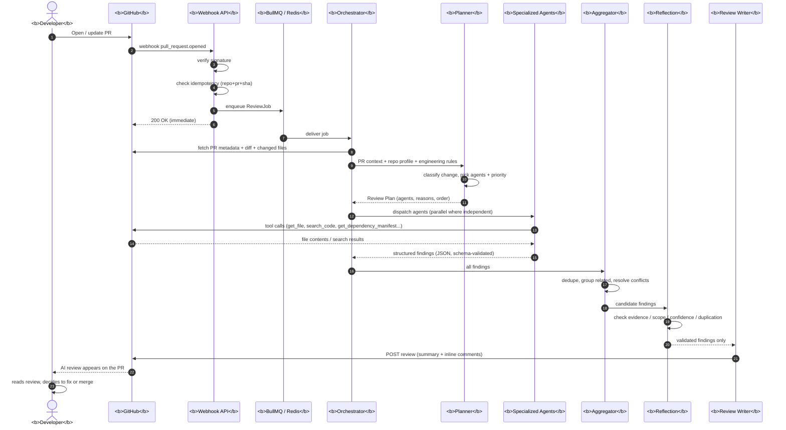
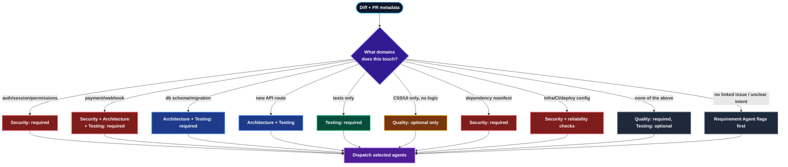
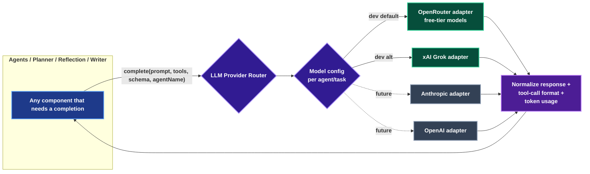
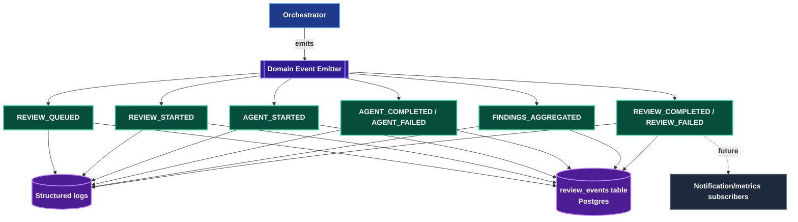
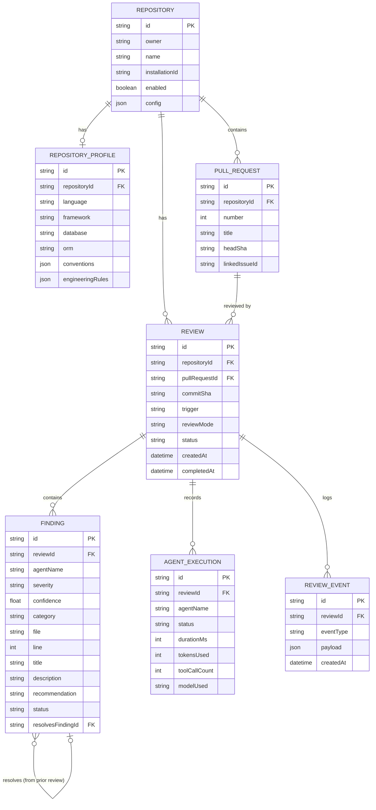

# PR Sentinel — System Architecture & Agent Orchestration Design

**Status:** Draft for discussion (v0.1)
**Scope:** Target architecture (Stage 1–3 of the PRD, with hooks for Reflection/Memory later)
**Stack decisions locked in so far:**
- Node.js + TypeScript, MERN-adjacent (Express/Fastify for the API layer)
- PostgreSQL + Prisma ORM for persistence
- BullMQ + Redis for the job queue
- GitHub App (not PAT) for GitHub auth, from day one
- Provider-agnostic LLM layer — OpenRouter / Grok free tier during development, swappable later
- Event-driven internal design

This document is the "north star" architecture — the full picture the PRDs describe. It is **not** a claim that we build all of it on day one. Section 9 maps this diagram onto a phased build order so we can decide where to actually start coding once you've reviewed this.

---

## 1. High-Level Architecture

```mermaid
flowchart TB
    subgraph GH["<b>GitHub</b>"]
        REPO[<b>Repository</b>]
        PR[<b>Pull Request</b>]
    end

    REPO -->|"<b>webhook: pull_request.opened / synchronize / reopened</b>"| API

    subgraph EDGE["<b>Webhook / API Layer (Express)</b>"]
        API[<b>Webhook Handler</b>]
        VERIFY[<b>Signature Verification</b>]
        DEDUPE[<b>Idempotency Check</b><br/>repo+pr+sha+mode]
    end

    API --> VERIFY --> DEDUPE
    DEDUPE -->|<b>new work</b>| ENQUEUE[<b>Create Review Record<br/>+ Enqueue Job</b>]
    DEDUPE -->|<b>duplicate</b>| DROP[<b>Ignore, return 200</b>]
    ENQUEUE -->|"<b>200 OK immediately</b>"| REPO

    subgraph QUEUE["<b>Redis / BullMQ</b>"]
        Q[(<b>ReviewJob Queue</b>)]
    end
    ENQUEUE --> Q

    subgraph WORKER["<b>Review Worker Process</b>"]
        ORCH[<b>Review Orchestrator</b>]
        CM[<b>Context Manager</b>]
        PLAN[<b>Planner Agent</b>]
        DISP{<b>Agent Dispatcher</b>}
    end

    Q --> ORCH
    ORCH --> CM
    CM -->|"<b>PR meta, diff, repo profile, engineering rules</b>"| PLAN
    PLAN -->|<b>Review Plan: agents + priority + reason</b>| DISP

    subgraph AGENTS["<b>Specialized Agents (parallel where independent)</b>"]
        A_ARCH[<b>Architecture Agent</b>]
        A_SEC[<b>Security Agent</b>]
        A_TEST[<b>Testing Agent</b>]
        A_QUAL[<b>Code Quality Agent</b>]
        A_REQ[<b>Requirement/Issue Agent</b>]
    end

    DISP --> A_ARCH
    DISP --> A_SEC
    DISP --> A_TEST
    DISP --> A_QUAL
    DISP --> A_REQ

    subgraph TOOLS["<b>GitHub Tool Layer (scoped per agent)</b>"]
        T1[<b>get_file / get_diff</b>]
        T2[<b>search_code</b>]
        T3[<b>get_directory_tree</b>]
        T4[<b>get_issue / get_dependency_manifest</b>]
    end

    A_ARCH -.-> TOOLS
    A_SEC -.-> TOOLS
    A_TEST -.-> TOOLS
    A_QUAL -.-> TOOLS
    A_REQ -.-> TOOLS
    TOOLS -->|"<b>GitHub App installation token</b>"| REPO

    A_ARCH & A_SEC & A_TEST & A_QUAL & A_REQ -->|<b>structured findings JSON</b>| AGG[<b>Finding Aggregator</b>]
    AGG -->|<b>dedupe + group + resolve conflicts</b>| REFL[<b>Reflection Agent<br/>(later stage)</b>]
    REFL -->|<b>validated findings only</b>| WRITE[<b>Review Writer</b>]
    WRITE -->|"<b>POST /reviews (summary + inline comments)</b>"| PR

    subgraph LLMLAYER["<b>Provider-Agnostic LLM Layer</b>"]
        ROUTER{<b>LLM Provider Router</b>}
        OR_[<b>OpenRouter / Grok<br/>dev default</b>]
        ANTH[<b>Anthropic<br/>future</b>]
        OAI[<b>OpenAI<br/>future</b>]
    end
    PLAN -.-> ROUTER
    A_ARCH & A_SEC & A_TEST & A_QUAL & A_REQ -.-> ROUTER
    REFL -.-> ROUTER
    WRITE -.-> ROUTER
    ROUTER --> OR_
    ROUTER -.-> ANTH
    ROUTER -.-> OAI

    subgraph STORE["<b>Persistence — PostgreSQL / Prisma</b>"]
        DB[(<b>Repository, Review,<br/>AgentExecution, Finding,<br/>RepositoryProfile</b>)]
    end
    ORCH -.->|<b>status transitions</b>| DB
    AGG -.-> DB
    WRITE -.-> DB
    DEDUPE -.-> DB

    classDef default fill:#1e293b,stroke:#475569,stroke-width:2px,color:#ffffff;
    classDef ghNode fill:#0f172a,stroke:#38bdf8,stroke-width:2px,color:#ffffff;
    classDef apiNode fill:#1e1b4b,stroke:#818cf8,stroke-width:2px,color:#ffffff;
    classDef queueNode fill:#311b92,stroke:#a78bfa,stroke-width:2px,color:#ffffff;
    classDef workerNode fill:#064e3b,stroke:#34d399,stroke-width:2px,color:#ffffff;
    classDef agentNode fill:#1e3a8a,stroke:#60a5fa,stroke-width:2px,color:#ffffff;
    classDef toolNode fill:#701a75,stroke:#f472b6,stroke-width:2px,color:#ffffff;
    classDef storeNode fill:#4c1d95,stroke:#c084fc,stroke-width:2px,color:#ffffff;
    classDef dropNode fill:#7f1d1d,stroke:#f87171,stroke-width:2px,color:#ffffff;

    class REPO,PR ghNode;
    class API,VERIFY,DEDUPE,ENQUEUE apiNode;
    class DROP dropNode;
    class Q queueNode;
    class ORCH,CM,PLAN,DISP workerNode;
    class A_ARCH,A_SEC,A_TEST,A_QUAL,A_REQ,AGG,REFL,WRITE agentNode;
    class T1,T2,T3,T4 toolNode;
    class ROUTER,OR_,ANTH,OAI apiNode;
    class DB storeNode;
```

**Key boundary to preserve (from the PRD):** the LLM decides *what to investigate* and *how to reason about evidence*; deterministic systems (linters, type checkers, test runners, the idempotency check, schema validation) own deterministic facts. The LLM is never asked to guess something a tool can verify.

---

## 2. Component Responsibilities

| Component | Responsibility | Notes |
|---|---|---|
| Webhook/API Layer | Verify signature, extract event, check idempotency, create Review record, enqueue job, return 2xx fast | Never runs the actual review synchronously |
| BullMQ/Redis Queue | Reliable job delivery, retries, backoff, concurrency control | One job = one `(repo, pr, commitSha, reviewMode)` |
| Review Orchestrator | Drives a single review through its lifecycle states; owns error handling and partial-completion logic | Runs in the worker process |
| Context Manager | Fetches PR metadata/diff/changed files, loads repository profile + engineering rules from DB | Implements "just-in-time" context retrieval, not whole-repo dumping |
| Planner Agent | Decides *which* specialized agents run and *why*, based on what changed | Does not judge code itself — see Section 4 |
| Agent Dispatcher | Executes the review plan; runs independent agents concurrently, respects declared dependencies | |
| Specialized Agents | Each owns one engineering concern (architecture, security, testing, quality, requirements) and returns schema-validated findings | Each has a scoped subset of tools — least privilege |
| GitHub Tool Layer | Authenticated, rate-limited, logged wrapper around GitHub REST/GraphQL using the App's installation token | Shared by all agents; enforces repo/PR scope |
| Finding Aggregator | Dedupes, groups related findings, resolves severity conflicts | |
| Reflection Agent | Critiques each surviving finding for evidence/scope/confidence before it's shown to you | Introduced once the base loop is proven — Stage 3/4 |
| Review Writer | Converts validated findings into a GitHub review (summary + inline comments), applies "fewer, higher-quality findings" rule | |
| LLM Provider Router | Single interface all agents call through; resolves to whichever provider/model is configured per agent/task | See Section 6 |
| Postgres/Prisma | System of record for repos, reviews, findings, agent executions, repository profiles | |

---

## 3. Review Lifecycle State Machine

```mermaid
flowchart TD
    START([<b>START</b>]) --> QUEUED[<b>QUEUED</b>]
    QUEUED --> INITIALIZING[<b>INITIALIZING</b>]
    INITIALIZING --> FETCHING_CONTEXT[<b>FETCHING_CONTEXT</b>]
    FETCHING_CONTEXT --> PLANNING[<b>PLANNING</b>]
    PLANNING --> RUNNING_AGENTS[<b>RUNNING_AGENTS</b>]
    RUNNING_AGENTS --> AGGREGATING[<b>AGGREGATING</b>]
    AGGREGATING --> REFLECTING[<b>REFLECTING</b>]
    REFLECTING --> GENERATING_REVIEW[<b>GENERATING_REVIEW</b>]
    GENERATING_REVIEW --> POSTING_TO_GITHUB[<b>POSTING_TO_GITHUB</b>]
    POSTING_TO_GITHUB --> COMPLETED[<b>COMPLETED</b>]
    COMPLETED --> END_NODE([<b>END</b>])

    RUNNING_AGENTS -->|<b>one or more agents fail (non-fatal)</b>| PARTIALLY_COMPLETED[<b>PARTIALLY_COMPLETED</b>]
    PARTIALLY_COMPLETED -->|<b>proceed with what succeeded</b>| AGGREGATING

    FETCHING_CONTEXT -->|<b>GitHub API failure (non-retryable)</b>| FAILED[<b>FAILED</b>]
    PLANNING -->|<b>LLM failure after retries</b>| FAILED
    RUNNING_AGENTS -->|<b>all agents fail</b>| FAILED
    POSTING_TO_GITHUB -->|<b>GitHub permission error</b>| FAILED

    QUEUED -->|<b>superseded by a newer commit on same PR</b>| CANCELLED[<b>CANCELLED</b>]
    FAILED --> END_FAILED([<b>END</b>])
    CANCELLED --> END_CANCELLED([<b>END</b>])

    classDef default fill:#1e293b,stroke:#475569,stroke-width:2px,color:#ffffff;
    classDef startEnd fill:#0f172a,stroke:#94a3b8,stroke-width:2px,color:#ffffff;
    classDef stateNode fill:#1e3a8a,stroke:#60a5fa,stroke-width:2px,color:#ffffff;
    classDef successState fill:#064e3b,stroke:#34d399,stroke-width:2px,color:#ffffff;
    classDef warnState fill:#78350f,stroke:#fbbf24,stroke-width:2px,color:#ffffff;
    classDef failState fill:#7f1d1d,stroke:#f87171,stroke-width:2px,color:#ffffff;

    class START,END_NODE,END_FAILED,END_CANCELLED startEnd;
    class QUEUED,INITIALIZING,FETCHING_CONTEXT,PLANNING,RUNNING_AGENTS,AGGREGATING,REFLECTING,GENERATING_REVIEW,POSTING_TO_GITHUB stateNode;
    class COMPLETED successState;
    class PARTIALLY_COMPLETED,CANCELLED warnState;
    class FAILED failState;
```

Every transition is a point where we emit an internal event (Section 7) and persist a status row — this is what makes the system observable and, later, dashboard-able.

---

## 4. End-to-End Sequence (happy path)



---

## 5. Planner — Agent Routing Logic

This is the answer to "which agent gets called in which case." The Planner Agent's *only* job is classification and routing — it never judges the code itself.

**Inputs:** PR title/description, diff, changed file paths, linked issue, repository profile (stack, conventions), engineering rules.

**Output contract:**
```json
{
  "objective": "Add payment webhook handling",
  "risk_level": "high",
  "affected_domains": ["payments", "webhooks", "database"],
  "tasks": [
    { "agent": "security", "priority": "required", "reason": "New external webhook endpoint" },
    { "agent": "architecture", "priority": "required", "reason": "New service-layer logic" },
    { "agent": "testing", "priority": "required", "reason": "New externally-triggered code path" },
    { "agent": "quality", "priority": "optional", "reason": "Moderate diff size" }
  ]
}
```

### Routing rules (starting heuristic set — tunable later)

| Signal in diff | Agents triggered | Why |
|---|---|---|
| Auth, session, token, permission, middleware files | Security (required), Architecture (required) | Access-control changes are high-risk by nature |
| Payment, billing, webhook handler files | Security, Reliability*, Testing, Architecture — all required | PRD's canonical high-risk example (idempotency, signature verification) |
| Database schema/migration files, Prisma schema changes | Architecture (required), Testing (required) | Schema changes ripple across the app |
| New or modified API route/controller | Architecture, Testing | Check layering + coverage of new surface |
| Test files only | Testing (required), Quality (optional) | Reviewing test quality itself |
| CSS/UI-only changes, no logic | Quality (optional), skip Security/Architecture | Avoid wasting LLM calls per PRD §47 |
| `package.json` / dependency manifest changed | Security (required) — dependency risk | Supply-chain concern |
| Infra/CI/Dockerfile/Terraform changed | Security, Reliability* | Deployment-risk surface |
| Diff touches files with no linked issue and no PR description | Requirement Agent flags "intent unclear" before other agents proceed | Prevents reviewing against an unknown goal |
| Everything else / small diff, low risk | Quality (required), Testing (optional) | Default light-touch path |

*Reliability isn't in the Stage-1 agent set yet (Section 9) — flagged here because the PRD calls it out explicitly for payment/infra PRs; we can fold its checks into Architecture initially and split it out later.



---

## 6. LLM Provider Abstraction

Per your call: every agent talks to one internal interface, not a specific vendor SDK. This makes the OpenRouter/Grok free-tier dev setup a config choice, not a code dependency.



Design points to lock down when we start coding:
- One `LLMProvider` interface: `complete({ messages, tools, responseSchema, agentName })` → normalized `{ content, toolCalls, usage }`, regardless of vendor.
- Per-agent model config (e.g. cheap/fast model for the Planner and PR-Understanding summary, a stronger model for Architecture/Security reasoning) — this is the PRD's cost-management guidance (§59) and is easy to honor once the router exists.
- Tool-calling format differs across providers (OpenAI-style function calling vs Anthropic tool_use vs whatever OpenRouter passes through) — the adapter layer normalizes this so agent code never touches vendor-specific shapes.
- Structured output validation (Zod/JSON schema) happens *after* normalization, so it's provider-independent.

---

## 7. Event-Driven Backbone

Two layers, doing different jobs — worth being explicit about this since it's your area of interest:

1. **BullMQ** — job *delivery*: "this review needs to run," with retries/backoff/concurrency. It's the transport.
2. **Internal domain events** — *state changes* within a review's lifecycle, persisted and (later) publishable to anything that wants to react: a future dashboard, Slack notification, metrics pipeline.



For Stage 1, this can be as simple as a Node `EventEmitter` inside the worker plus a `review_events` table it writes to — not a separate message broker. That alone gives you the audit trail the PRD's Observability section (§58) wants, and it's the seam where a future dashboard or Slack integration would subscribe without touching orchestration logic.

---

## 8. Data Model (Prisma / PostgreSQL)



`resolvesFindingId` is what powers re-review comparisons (PRD §38–39: detecting when a previously-flagged issue was fixed in a new commit).

---

## 9. Mapping This Architecture Onto a Build Order

This is the full target picture. We haven't yet decided where to start cutting code — that's the next conversation. Here's how the diagram above maps onto the PRD's staged rollout, so you can pick a starting slice with the whole picture in view:

| Slice | What exists | What's stubbed/skipped |
|---|---|---|
| **Stage 1** | Webhook layer, idempotency, BullMQ, one non-tool-using agent, Review Writer, GitHub App auth, Postgres for Review/Finding | No Planner, no multi-agent split, no tools, no Reflection |
| **Stage 2** | + GitHub Tool Layer, agent can call `get_file`/`search_code` | Still one agent, no Planner routing yet |
| **Stage 3** | + Planner, Agent Dispatcher, the 5 specialized agents running in parallel, Aggregator | No Reflection yet — findings go straight to Review Writer |
| **Stage 4** | + Reflection Agent | |
| **Stage 5+** | + Repository Profile/memory, engineering rules, deterministic tooling (lint/typecheck/test runners feeding agents facts) | Dashboard, multi-tenant, risk scoring — later |

Everything in Sections 1–8 is designed so each later slice bolts on without re-architecting the earlier one (e.g. the Planner routing table in Section 5 works whether it's driving one agent's tool selection in Stage 2 or five agents' dispatch in Stage 3).

---

## 10. Open Decisions Before We Start Coding

These are things this document deliberately leaves open — worth deciding once you've reviewed the diagrams:

1. **Starting slice** — Stage 1 (prove the loop, one agent, no tools) vs. jumping straight to Stage 2 (tool-calling from the start). You'd flagged wanting to finalize the full picture first, which this doc is — next step is picking the entry point.
2. **Review posting strategy** — one GitHub "review" object with all inline comments batched, vs. incremental comments as agents finish. PRD favors a single batched review (quality over quantity, §51).
3. **Exact severity/confidence thresholds** — PRD suggests suppressing findings below 0.60 confidence; final numbers are configurable but need a first value.
4. **GitHub App scope** — which repos it's installed on initially (your existing repo(s) + the future seeded demo repo), and exact permission set (contents: read, pull requests: write, issues: read at minimum).
5. **Reliability Agent** — fold into Architecture Agent for now, or stand it up as its own agent given payment/infra PRs need it per the routing table in Section 5.
